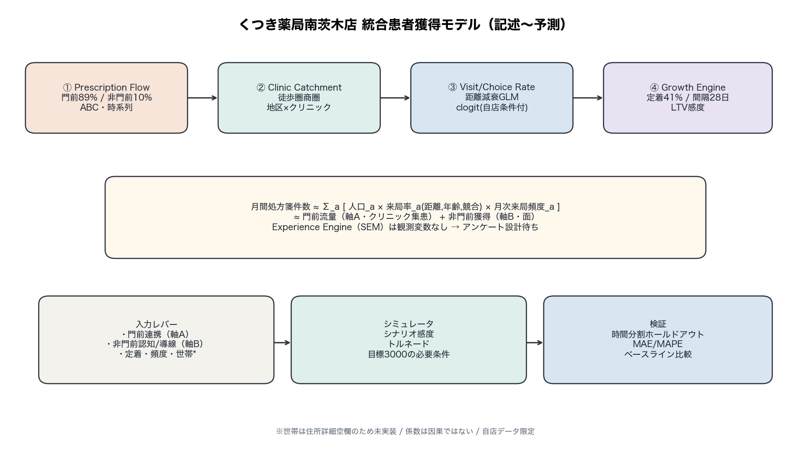
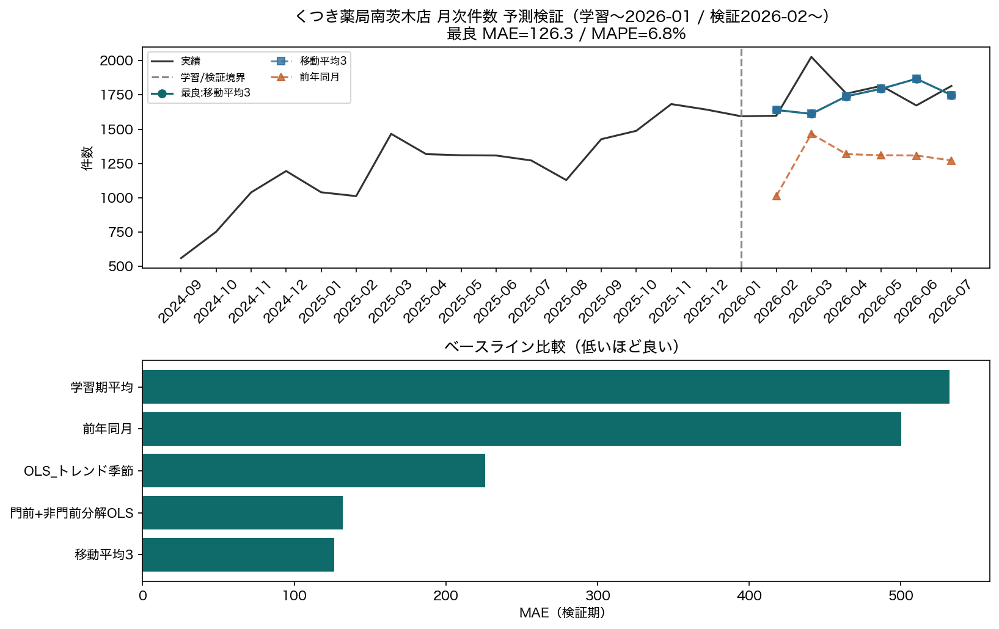
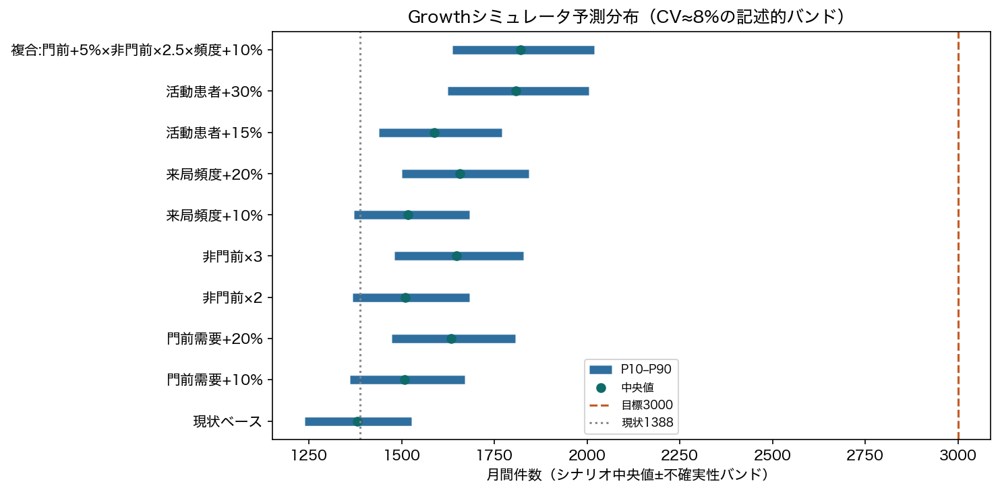

# Phase 6: 統合モデルと成果物

## わかったこと3点

1. **統合式は「人口×来局率×頻度」＋門前/非門前分解で運用可能。** Experience（SEM）は欠測のため設計のみ。
2. **月次予測の時間分割検証で最良は「移動平均3」（MAE=126.3, MAPE=6.8%）。** 単純平均より改善。
3. **目標3,000は単一レバーでは到達確率が低い。** シナリオバンド上、複合施策が必要（Phase3と整合）。

## わからなかったこと3点

1. 因果的な施策効果（Phase5: イベント年表待ち）。
2. 複数店舗での外部妥当性。
3. 世帯波及（住所詳細空欄）。

## 次に必要なデータ

- イベント年表、他店舗同一スキーマ、クリニック総発行数、住所詳細、アンケート

---

## 統合図



### 式系（運用版）

```
月間件数_t
  = Gate_t + NonGate_t
  = Σ_a Population_a × VisitRate_a(distance, age, competition) × Freq_a,t
```

- VisitRate は Phase3 集計Binomial GLM（距離減衰が主）
- Freq / 定着は Phase4（90日定着≈41%, 間隔中央値28日）
- Gate ≈ クリニック集患（軸A）。薬局施策の直接効果は小さい可能性
- NonGate ≈ 面の成長余地（軸B）

依頼書の「商圏人口×クリニック選択率×薬局選択率×継続率」は上式に対応：
クリニック選択率×薬局選択率 ≒ 自店来局率（分母=人口）に吸収。

---

## 予測検証（〜2026-01学習 / 2026-02〜検証）



```
        モデル        MAE     MAPE%
      移動平均3 126.333333  6.771008
門前+非門前分解OLS 132.166667  7.547282
 OLS_トレンド季節 225.767902 13.234842
       前年同月 500.333333 28.169360
      学習期平均 532.156863 29.484392
```

- 学習月数=17 / 検証月数=6
- 全国処方箋は月次の統制候補だが、検証期のカバレッジに注意

---

## シミュレータ（予測分布）



```
                   シナリオ         p10         p50         p90  目標到達確率
                  現状ベース 1239.624461 1381.081019 1526.205093     0.0
               門前需要+10% 1360.629021 1508.763002 1670.048990     0.0
               門前需要+20% 1473.016822 1633.922658 1806.679133     0.0
                  非門前×2 1367.119741 1509.068985 1683.276328     0.0
                  非門前×3 1481.409109 1647.208596 1828.400608     0.0
               来局頻度+10% 1372.044389 1517.418398 1683.217941     0.0
               来局頻度+20% 1500.139209 1657.266862 1841.655548     0.0
               活動患者+15% 1438.314414 1587.521801 1769.167537     0.0
               活動患者+30% 1624.228396 1807.417935 2004.431772     0.0
複合:門前+5%×非門前×2.5×頻度+10% 1637.513311 1820.125258 2019.510531     0.0
```

---

## 学術ポジショニング

詳細: [`academic_positioning.md`](academic_positioning.md)

---

## Phase5について

中断時系列・CausalImpact・DiDは**イベント年表取得後**に実施する。現時点で回帰係数を因果効果と書かない。

## 限界

- 1店舗・自店来局のみ
- 係数は相関/条件付き関連
- シナリオバンドのCVは仮置き
