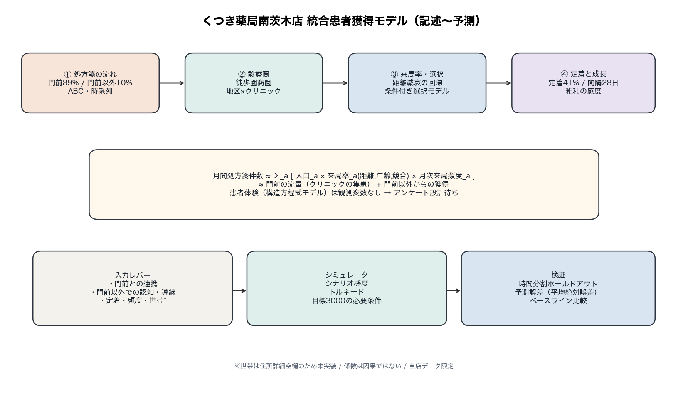
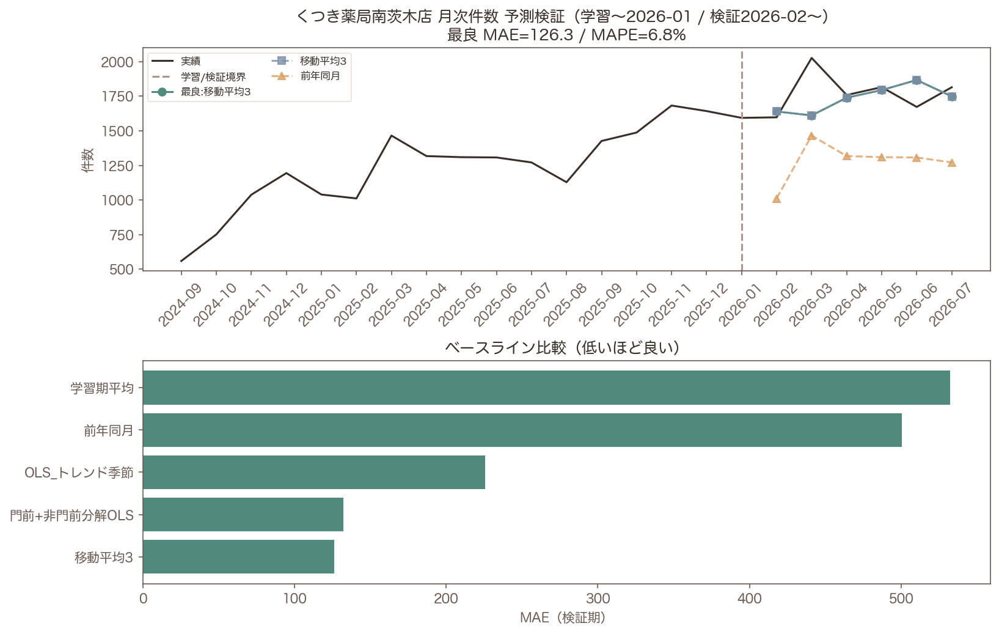
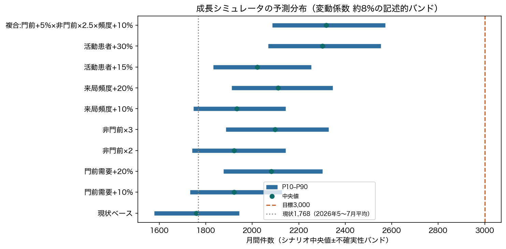

# Phase 6: 統合モデルと成果物

## わかったこと3点

1. **統合式は「人口×来局率×頻度」＋門前/非門前分解で運用可能。** Experience（SEM）は欠測のため設計のみ。
2. **月次予測の時間分割検証で最良は「移動平均3」（MAE=126.3, MAPE=6.8%）。** 単純平均より改善。
3. **今の施策の延長では目標3,000に届かない。** 現状（2026年5〜7月平均）1,768枚に対し、シナリオバンド上の到達確率は最大0%（Phase3と整合）。

## わからなかったこと3点

1. 因果的な施策効果（Phase5: 年表で推定したが、いずれも判定できない）。
2. 複数店舗での外部妥当性。
3. 世帯波及（住所詳細空欄）。

## 次に必要なデータ

- 他店舗同一スキーマ、クリニック総発行数、住所詳細、アンケート

---

## 統合図



### 式系（運用版）

```
月間件数_t
  = Gate_t + NonGate_t
  = Σ_a Population_a × VisitRate_a(distance, age, competition) × Freq_a,t
```

- VisitRate は Phase3 集計Binomial GLM（距離減衰が主）
- Freq / 定着は Phase4（90日定着≈41%, 間隔中央値28日）
- Gate ≈ クリニック集患（軸A）。薬局施策の直接効果は小さい可能性
- NonGate ≈ 面の成長余地（軸B）

依頼書の「商圏人口×クリニック選択率×薬局選択率×継続率」は上式に対応：
クリニック選択率×薬局選択率 ≒ 自店来局率（分母=人口）に吸収。

---

## 予測検証（〜2026-01学習 / 2026-02〜検証）



```
        モデル        MAE     MAPE%
      移動平均3 126.333333  6.771008
門前+非門前分解OLS 132.166667  7.547282
 OLS_トレンド季節 225.767902 13.234842
       前年同月 500.333333 28.169360
      学習期平均 532.156863 29.484392
```

- 学習月数=17 / 検証月数=6
- 全国処方箋は月次の統制候補だが、検証期のカバレッジに注意

---

## シミュレータ（予測分布）



```
                   シナリオ         p10         p50         p90  目標到達確率
                  現状ベース 1579.002915 1759.186773 1944.042222     0.0
               門前需要+10% 1733.135526 1921.824919 2127.267013     0.0
               門前需要+20% 1876.292321 2081.250187 2301.303103     0.0
                  非門前×2 1741.403243 1922.214673 2144.115668     0.0
                  非門前×3 1886.982208 2098.173486 2328.971380     0.0
               来局頻度+10% 1747.676139 1932.849948 2144.041297     0.0
               来局頻度+20% 1910.840146 2110.985455 2345.855194     0.0
               活動患者+15% 1832.089254 2022.145925 2253.521762     0.0
               活動患者+30% 2068.901876 2302.244170 2553.195514     0.0
複合:門前+5%×非門前×2.5×頻度+10% 2085.823872 2318.430444 2572.402463     0.0
```

---

## 学術ポジショニング

詳細: [`academic_positioning.md`](academic_positioning.md)

---

## Phase5について

先方の施策年表（2026-09-30受領）で差の差と比較ITSを実施した（`phase5_causal.html`）。いずれも「判定できない」ため、回帰係数を因果効果と書かない。

## 限界

- 1店舗・自店来局のみ
- 係数は相関/条件付き関連
- シナリオバンドのCVは仮置き
