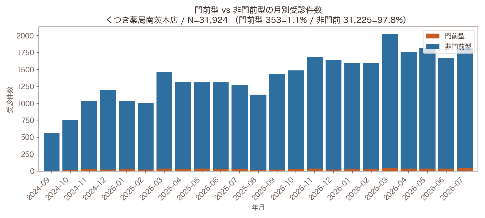
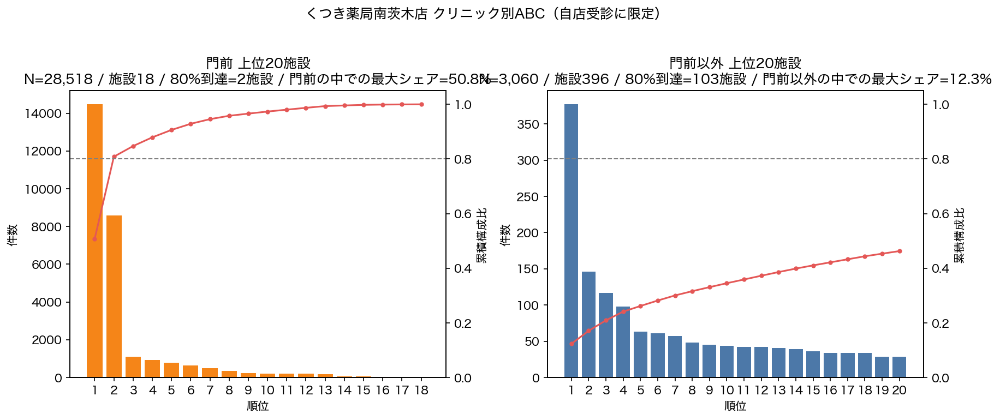
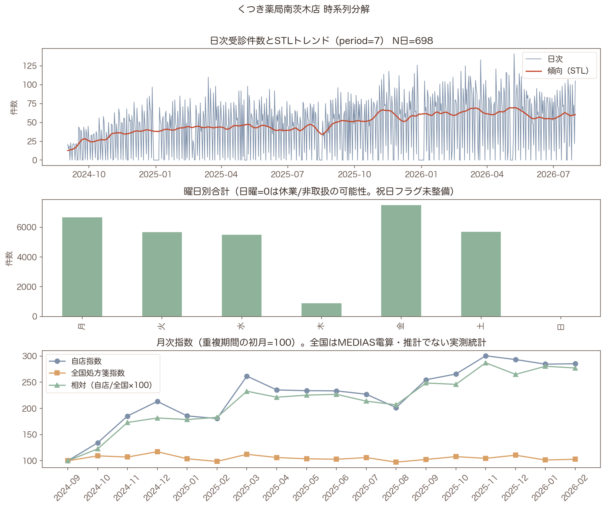
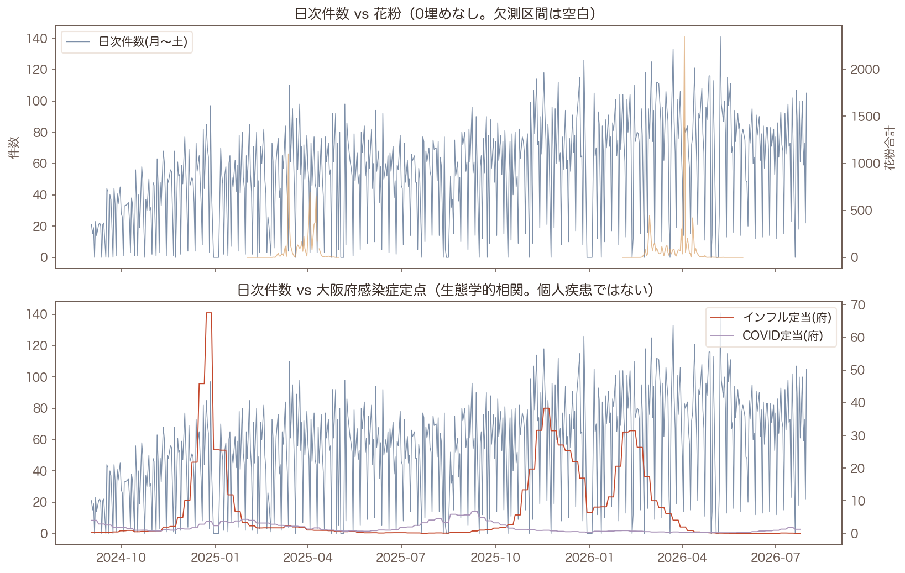
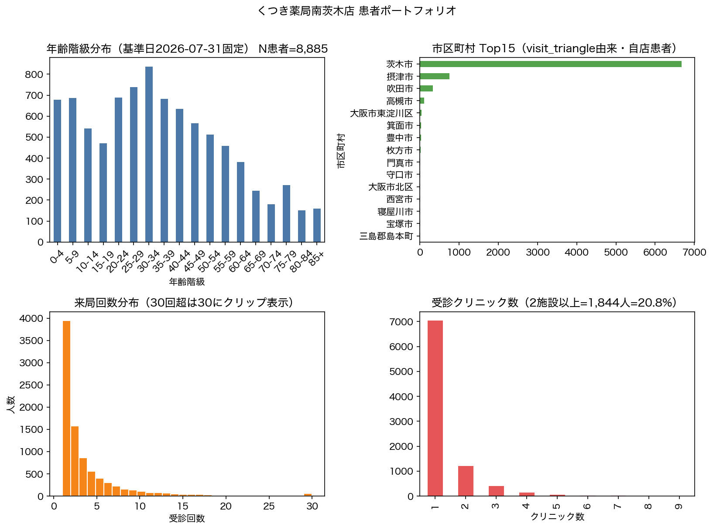

# Phase 1: Prescription Flow Theory（記述）

## わかったこと3点

1. **上位クリニックへの集中が規模を決める。** 全体の80%件数は上位 **5** 施設で到達。最大シェア施設は **45.9%**（経営の単一クリニック依存リスク）。
2. **非門前は別構造。** 非門前の80%到達施設数は **4**、最大シェア **46.4%**。クリニック→薬局距離の中央値が門前より大きく、面の獲得は分散した多数施設経由。
3. **外生要因は曜日・季節が主で、花粉・府感染症は補助的。** 花粉は欠測を0埋めせず飛散期のみ推定（N=178日）。府定点は生態学的相関に留まる。

## わからなかったこと3点

1. 上位門前クリニックの「総発行処方箋」に対する自店シェア（分母なし）。
2. 全国指数との相対変動の因果（イベント年表なし）。祝日フラグ未整備。
3. 面利用候補（受診クリニック数≥2）の獲得経路（紹介/検索等）は非観測。

## 次に必要なデータ

- クリニック別総処方箋発行数、祝日カレンダー、イベント年表、他店舗データ（`docs/QUESTIONS_TO_CLIENT.md`）

---

## この薬局は面薬局か門前薬局か（数値回答）

**結論: 門前依存ではない（門前型＝クリニックから40m以内 1.1%）。** 非門前 97.8%（31,225件）。

| 区分 | 受診件数 | 構成比 | ユニーク患者 |
|---|---:|---:|---:|
| 門前型 | 353 | 1.1% | 16 |
| 非門前型 | 31,225 | 97.8% | 8,721 |
| 不明 | 346 | 1.1% | — |



> 注: すべて自店受診データ。市場全体の立地構成ではない。

---

## 1. 医療機関別 ABC / パレート（層別）



### 全体
- 施設数: 430 / 件数: 31,918
- **80%到達: 5 施設** / **最大シェア: 45.9%**

```
           クリニック名    件数   構成比  クリニック→薬局_直線km                                                             診療科  門前判定
    医療法人はせがわ耳鼻咽喉科 14644 45.9%          0.300                                                           耳鼻咽喉科 False
       平山皮フ科クリニック  8671 27.2%          0.300                                                             皮膚科 False
          藤井クリニック  1120  3.5%          0.044                                                    内科・小児科・消化器内科 False
   医療法人創康会岸本クリニック   918  2.9%          0.077                                    内科・脳神経外科・放射線科・リハビリテーション科・麻酔科 False
    医療法人 恵仁会　田中病院   782  2.5%          0.210 内科・消化器内科・外科・消化器外科・肛門外科・整形外科・泌尿器科・産科・婦人科・小児科・リハビリテーション科・放射線科・麻酔科 False
      南茨木皮ふ科クリニック   650  2.0%          0.109                                                       皮膚科・小児皮膚科 False
     南茨木グリーンクリニック   486  1.5%          0.263                                                    泌尿器科・内科・形成外科 False
医療法人　医泉会　かしまクリニック   378  1.2%          0.744                                      内科・呼吸器内科・アレルギー科・リハビリテーション科 False
          髙岡クリニック   353  1.1%          0.037                                                        心療内科・精神科  True
       医療法人高島整形外科   226  0.7%          0.288                                        整形外科・リハビリテーション科・リウマチ科・内科 False
```

### 門前型
- 80%到達: **1 施設** / 最大シェア: **100.0%**

```
 クリニック名  件数    構成比  クリニック→薬局_直線km      診療科  門前判定
髙岡クリニック 353 100.0%          0.037 心療内科・精神科  True
```

### 非門前型（軸B）
- 80%到達: **4 施設** / 最大シェア: **46.4%**

```
           クリニック名    件数   構成比  クリニック→薬局_直線km                                                             診療科  門前判定
    医療法人はせがわ耳鼻咽喉科 14475 46.4%          0.300                                                           耳鼻咽喉科 False
       平山皮フ科クリニック  8576 27.5%          0.300                                                             皮膚科 False
          藤井クリニック  1107  3.5%          0.044                                                    内科・小児科・消化器内科 False
   医療法人創康会岸本クリニック   913  2.9%          0.077                                    内科・脳神経外科・放射線科・リハビリテーション科・麻酔科 False
    医療法人 恵仁会　田中病院   772  2.5%          0.210 内科・消化器内科・外科・消化器外科・肛門外科・整形外科・泌尿器科・産科・婦人科・小児科・リハビリテーション科・放射線科・麻酔科 False
      南茨木皮ふ科クリニック   641  2.1%          0.109                                                       皮膚科・小児皮膚科 False
     南茨木グリーンクリニック   483  1.5%          0.263                                                    泌尿器科・内科・形成外科 False
医療法人　医泉会　かしまクリニック   377  1.2%          0.744                                      内科・呼吸器内科・アレルギー科・リハビリテーション科 False
       医療法人高島整形外科   226  0.7%          0.288                                        整形外科・リハビリテーション科・リウマチ科・内科 False
 医）廉心会消化器内視鏡ｸﾘﾆｯｸ   217  0.7%          0.109                                                        消化器内科・内科 False
```

CSV: `data/processed/abc_clinics_*.csv`

---

## 2. 時系列分解



- 日次平均: 45.7（SD 35.5）※全日（日曜0含む）
- STLトレンド: 12.7 → 60.3
- 曜日合計: {'月': 6678, '火': 5679, '水': 5484, '木': 897, '金': 7494, '土': 5692, '日': 0}
- 全国MEDIASとの月次指数: `data/processed/monthly_vs_national.csv`（全国は都道府県別月次非公表のため全国統制）

---

## 3. 外生要因（負の二項GLM・相関として報告）



**サンプル定義**
- 気象モデル: 月〜土のみ、気象欠損除外、N=599日 / AIC=5794.8
- 花粉モデル: 花粉合計非欠損日のみ（0埋め禁止）、N=178日 / AIC=1776.607255944986
- 感染症モデル: 大阪府定点を日次に展開、N=594日 / AIC=5723.5

**主な係数（IRR=exp(β)、因果ではない）**
- 最高気温: IRR=1.008 (p=0.655)
- 最低気温: IRR=1.006 (p=0.800)
- 降水量mm: IRR=0.998 (p=0.638)
- 花粉合計: IRR=1.000 (p=0.785)
- 感染症定当: COVID-19: IRR=0.924 (p=0.007), インフルエンザ: IRR=1.012 (p=0.008), 感染性胃腸炎: IRR=1.057 (p=0.008)

> 限界: 祝日ダミーなし。感染症は府単位の生態学的相関。個人の疾患とは結合していない。

係数CSV: `data/processed/glm_coefs_*.csv`

---

## 4. 患者ポートフォリオ



- 来局回数: 平均 3.59 / 中央値 2
- **面利用候補（受診クリニック数≥2）: 1,844人（20.8%）**
  - 平均来局 8.3回 / 年齢中央値 31
  - 初回が非門前の割合 98.8%
  - 上位市区町村: {'茨木市': 1636, '摂津市': 53, '吹田市': 18, '高槻市': 14, '高島市': 6}
- 年齢・地域の詳細: `data/processed/patient_portfolio.csv`

> 注: 年齢は基準日2026-07-31固定。市区町村は visit_triangle 由来（patient_master の住所テキストは意図的空欄）。

---

## 5. 流動フロー（Sankey）

- 全体（上位12地域→上位20クリニック→薬局）: [phase1_sankey.html](figures/phase1_sankey.html)
- 非門前のみ: [phase1_sankey_nongate.html](figures/phase1_sankey_nongate.html)

> 注: タイトルどおり「自店に来た患者におけるフロー」。真の地区別クリニック選択率ではない。

---

## サンプル定義・限界（共通）

1. 対象: くつき薬局南茨木店の自店受診 31,924 件（2024-09-02〜2026-07-31）
2. 門前型 = 立地パターン「門前型」。非門前 = 患者近接/経由/遠隔。不明=346件（座標欠測等）
3. 新患フラグは使用していない
4. 花粉欠損は0埋めしていない
5. GLM係数は条件付き関連であり因果効果ではない
