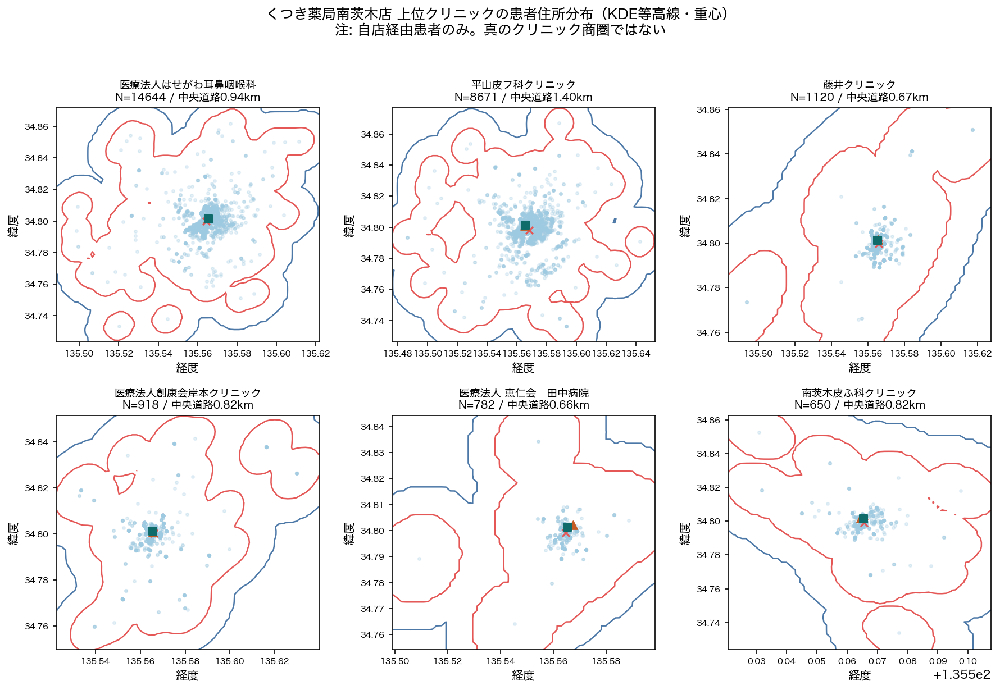
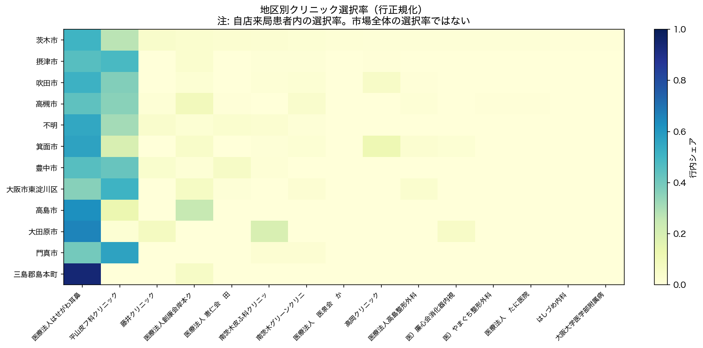
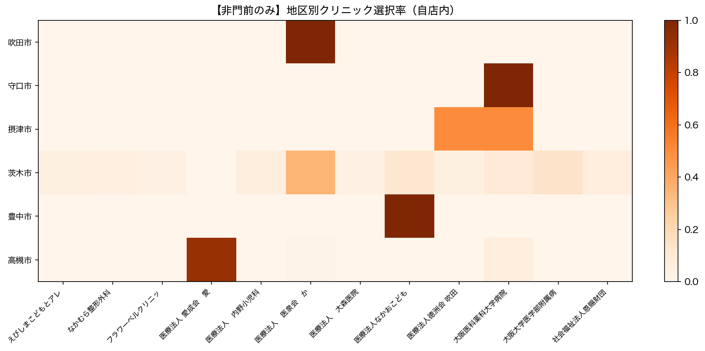
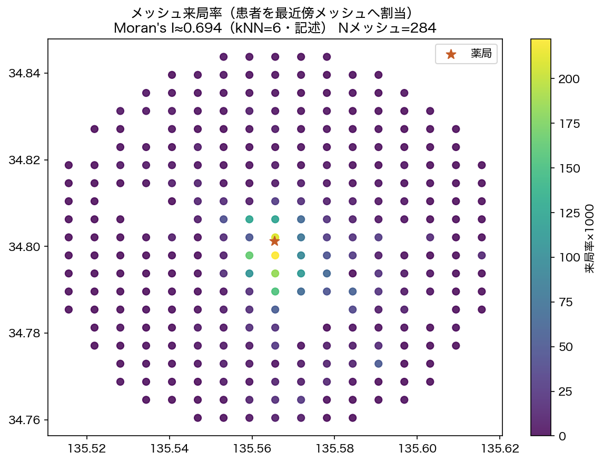
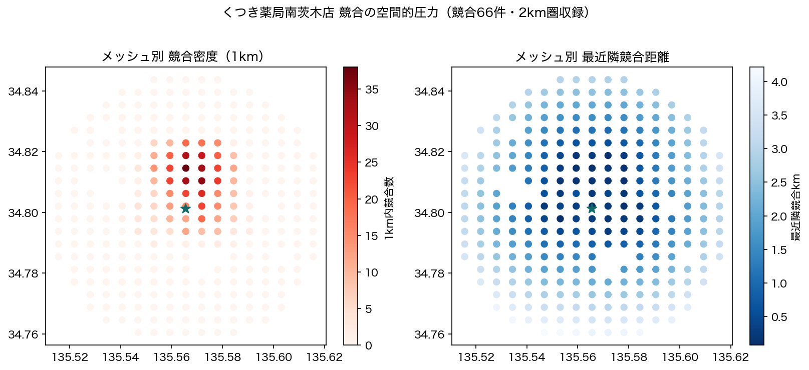
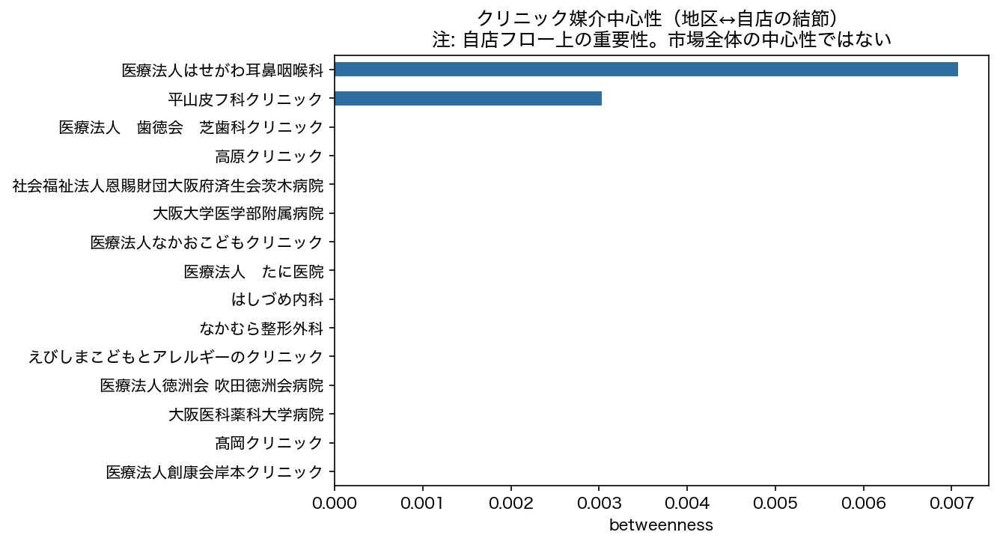

# Phase 2: Clinic Catchment Area

## わかったこと3点

1. **上位クリニックの商圏は徒歩圏中心。** 件数≥100の施設で患者→クリニック道路km中央値はおおむね1km前後（詳細は `clinic_catchments_top.csv`）。
2. **地区×クリニックの偏りは依頼書仮説と整合しうる。** 行正規化選択率の上位ペアを表に示す（**自店患者内の選択率**）。
3. **メッシュ来局率に空間相関（Moran's I≈0.694）。** ホット/コールドスポットは獲得余地の候補。競合1km密度と併せて読む。

## わからなかったこと3点

1. 真の地区別クリニック選択率（自店非来局者のクリニック選択が非観測）。
2. 厳密な測地商圏面積（本Phaseは局所平面近似。EPSG:6674投影は次段で強化可能）。
3. 競合の処方箋規模がないため、圧力指標は立地・営業時間代理に留まる。

## 次に必要なデータ

- クリニック総発行数、競合規模代理、他店舗データ（`docs/QUESTIONS_TO_CLIENT.md`）

---

## 1. クリニック別商圏



```
クリニックID         クリニック名    件数  座標あり件数  商圏サンプル件数_道路10km内  直線km_中央値  道路km_中央値      重心緯度       重心経度  楕円長軸_km  楕円短軸_km     楕円方位_度
   C001  医療法人はせがわ耳鼻咽喉科 14644   14475             13524     0.643     0.939 34.799964 135.564416 2.357321 1.620539  79.171150
   C002     平山皮フ科クリニック  8671    8576              7952     1.030     1.401 34.798083 135.568171 2.863597 2.218228  90.438209
   C003        藤井クリニック  1120    1107              1091     0.461     0.668 34.799791 135.565821 1.757993 0.952134  59.750965
   C004 医療法人創康会岸本クリニック   918     913               863     0.589     0.823 34.800351 135.566022 2.618994 1.727720  59.847610
   C005  医療法人 恵仁会　田中病院   782     772               750     0.393     0.661 34.799146 135.564765 0.933248 0.703159  77.673267
   C006    南茨木皮ふ科クリニック   650     641               609     0.546     0.824 34.798956 135.565496 1.752696 0.995048 104.816309
```

## 2. 地区 × クリニック





### 地区内第1クリニック（自店患者内選択率）

```
   市区町村       第1クリニック  選択率_自店内    件数  市区町村合計
 三島郡島本町 医療法人はせがわ耳鼻咽喉科 0.938776    46      49
   大田原市 医療法人はせがわ耳鼻咽喉科 0.653846    34      52
    高島市 医療法人はせがわ耳鼻咽喉科 0.625000     5       8
    箕面市 医療法人はせがわ耳鼻咽喉科 0.563107    58     103
    門真市    平山皮フ科クリニック 0.562500    27      48
     不明 医療法人はせがわ耳鼻咽喉科 0.550489   169     307
    吹田市 医療法人はせがわ耳鼻咽喉科 0.512019   426     832
大阪市東淀川区    平山皮フ科クリニック 0.510638    48      94
    茨木市 医療法人はせがわ耳鼻咽喉科 0.505353 12085   23914
    摂津市    平山皮フ科クリニック 0.484021   939    1940
```

## 3. メッシュ来局率・空間相関



- Moran's I（kNN=6）≈ **0.694** / メッシュ数 284

ホットスポット候補（抜粋）:

```
  メッシュコード  総人口  来局ユニーク      来局率  距離km
523514553 3969     882 0.222222 0.377
523514651 4955    1037 0.209284 0.090
523514551 1758     323 0.183732 0.840
523514544 2085     343 0.164508 0.667
523514453  994     153 0.153924 1.303
```

コールドスポット候補（抜粋）:

```
  メッシュコード  総人口  来局ユニーク  来局率  距離km
523514281  701       0  0.0 4.997
523514891   56       0  0.0 4.979
523514882 1226       0  0.0 4.459
523514793  966       0  0.0 4.817
523514791  234       0  0.0 4.696
```

## 4. 競合圧力



- 競合収録: 2km圏66件。メッシュ別に最近隣距離・500m/1km件数・日曜営業競合を付与 → `mesh_competitor_pressure.csv`

## 5. ネットワーク（媒介中心性）



```
医療法人はせがわ耳鼻咽喉科           0.007071
平山皮フ科クリニック              0.003030
医療法人　歯徳会　芝歯科クリニック       0.000000
高原クリニック                 0.000000
社会福祉法人恩賜財団大阪府済生会茨木病院    0.000000
大阪大学医学部附属病院             0.000000
医療法人なかおこどもクリニック         0.000000
医療法人　たに医院               0.000000
はしづめ内科                  0.000000
なかむら整形外科                0.000000
```

地図: [phase2_map.html](figures/phase2_map.html)

> 注: すべて自店受診フローに基づく。市場全体の商圏・選択率・中心性ではない。
