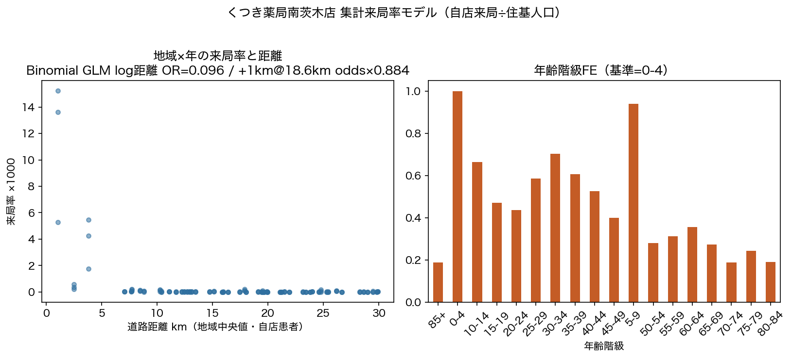
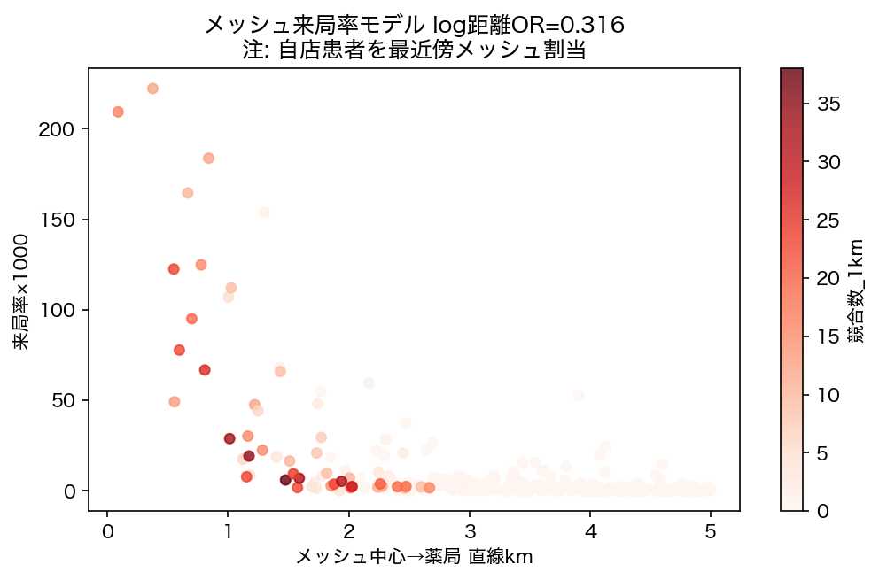
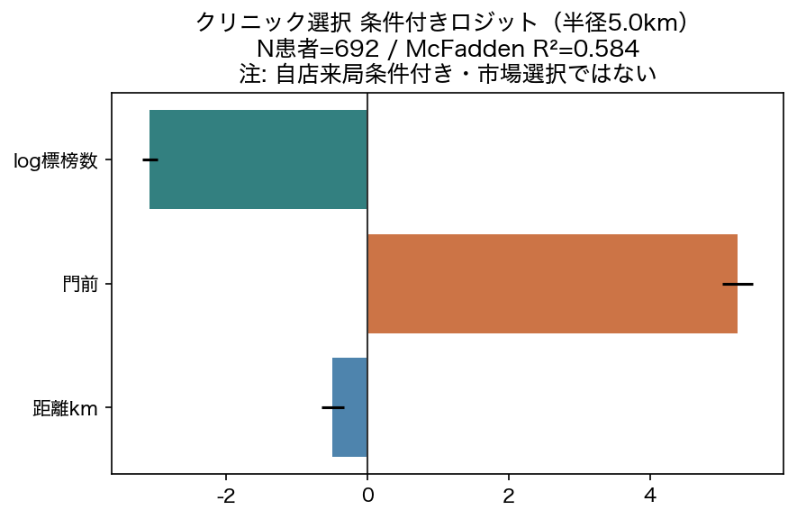
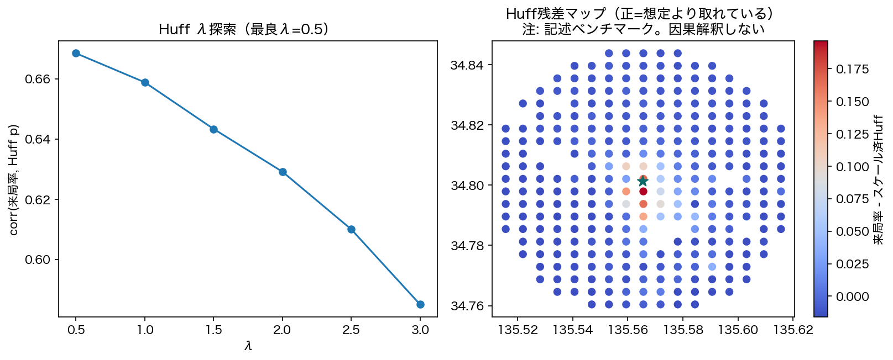
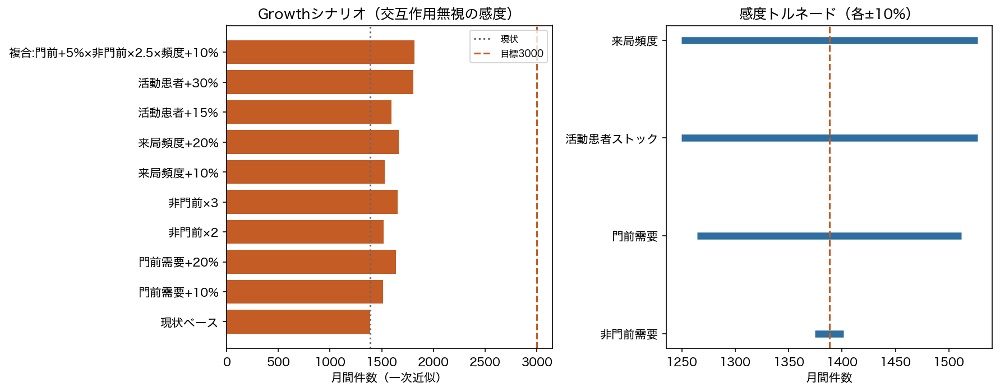

# Phase 3: 来局率モデルと Pharmacy Choice Rate

## わかったこと3点

1. **距離は来局率を強く規定する。** 集計Binomial GLMで log(道路距離) のOR=0.096。中央距離18.6kmで+1kmすると選択オッズが約×0.884（相関・条件付き関連）。
2. **クリニック選択でも距離・門前が効く（自店条件付き）。** 条件付きロジット N=692 / McFadden R²=0.584。これは市場全体の選択率ではない。
3. **目標3,000枚は非門前の大幅拡大か複数レバーの同時改善が必要。** シミュレータ上、非門前のみなら約×13.1が必要（他固定の粗い必要条件）。

## わからなかったこと3点

1. 真の薬局選択率（競合の実売・クリニック総発行数が未知）。
2. Huffのλ・魅力度は代理変数のみで識別が弱い。
3. 年齢は2026-07-31固定のまま年次比較している点のバイアス。

## 次に必要なデータ

- クリニック総処方箋発行数、競合規模、他店舗、イベント年表（優先度A）

---

## 6.1 集計来局率モデル（主分析）



- サンプル: 地域×年齢×年、道路距離≤30km かつ距離観測あり、N行=2,808 / 地域数=52
- モデル: Binomial GLM（var_weights=人口）、年齢FE・年FE、HC1
- AIC=116667.0
- 受療率: 全国・外来・年齢別（大阪府最新年は総数のみのため）（年齢構成の需要差を分離する目的）
- 競合は距離と共線のため地域モデルから除外し、メッシュモデルで評価

> 注: 来局率 = 自店ユニーク来局 / 住基人口。非来局を外部選択肢とみなした集計近似。係数は因果ではない。



メッシュ版 log距離OR=0.316

---

## 6.2 クリニック選択（条件付きロジット）



- 半径5.0km / 平均選択肢数≈177.8
- β距離=-0.492, β門前=5.240, β log標榜=-3.077

> **選択バイアス:** 推定対象は「最終的に自店に来た患者」のクリニック選択。一般人口のクリニック選択ではない。

---

## 6.3 Huff（記述ベンチマーク）



- 最良λ=0.5 / corr=0.669
- 残差マップは「想定より取れている／取れていない」メッシュの記述用。パラメータの因果解釈はしない。

---

## 6.4 Growth Engine 分解とシナリオ



```
                   シナリオ     予測月間件数   対ベース倍率  目標3,000到達                         注記
                  現状ベース 1388.00000 1.000000      False                       実測平均
               門前需要+10% 1511.94840 1.089300      False 軸A: 直近クリニック流量増。薬局施策の寄与は限定的
               門前需要+20% 1635.89680 1.178600      False                         軸A
                  非門前×2 1521.24800 1.096000      False                 軸B: 面獲得の拡大
                  非門前×3 1654.49600 1.192000      False                         軸B
               来局頻度+10% 1526.80000 1.100000      False              継続率・処方間隔の改善代理
               来局頻度+20% 1665.60000 1.200000      False                         継続
               活動患者+15% 1596.20000 1.150000      False             新規獲得（門前+非門前合算）
               活動患者+30% 1804.40000 1.300000      False                       新規獲得
複合:門前+5%×非門前×2.5×頻度+10% 1814.83082 1.307515      False                   同時施策の粗い積
   参考:非門前のみで目標→×13.1が必要 3000.00000 2.161383       True    他条件一定のときの必要条件（実現可能性の目安）
```

依頼書の商圏人口×クリニック選択率×薬局選択率×継続率は、本分解の「人口×来局率×頻度」に対応づける（薬局選択率は集計来局率に吸収）。

---

## サンプル定義・限界

1. 自店来局のみ。市場シェア分母なし
2. 距離は自店患者の地域中央値（生態学的）
3. 受療率は大阪府外来・最新調査年の接続（推計接続）
4. 係数は因果効果ではない
