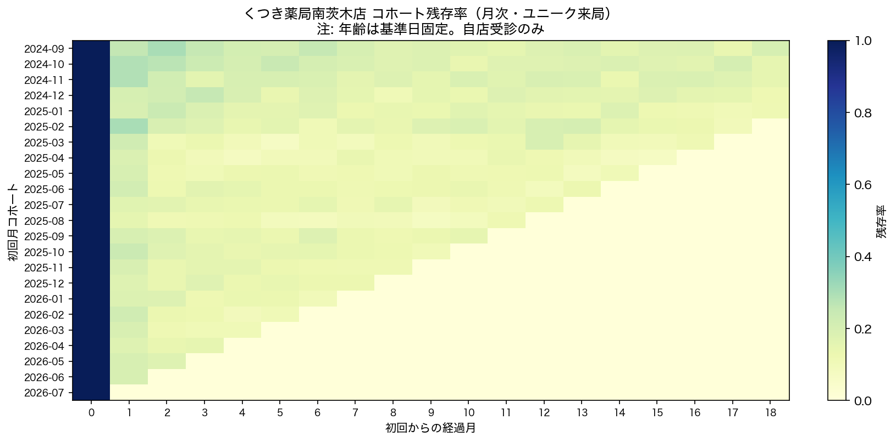
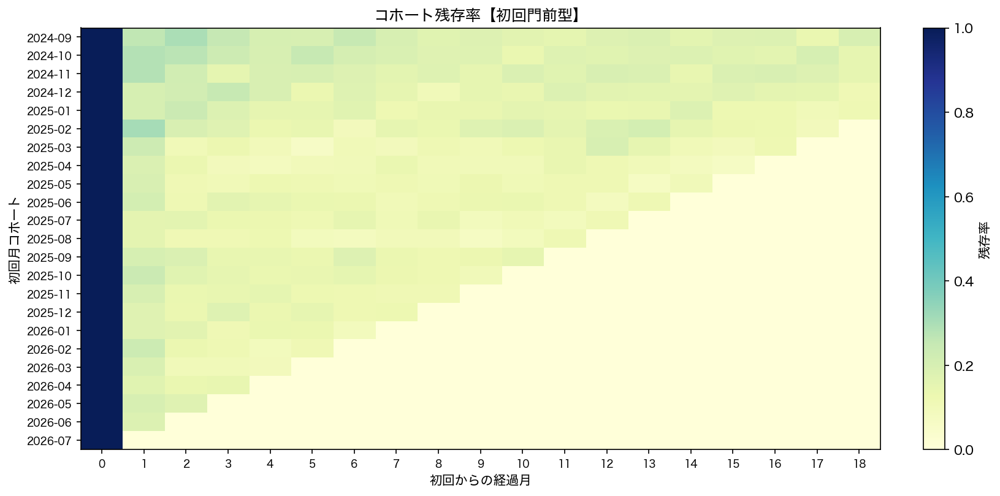
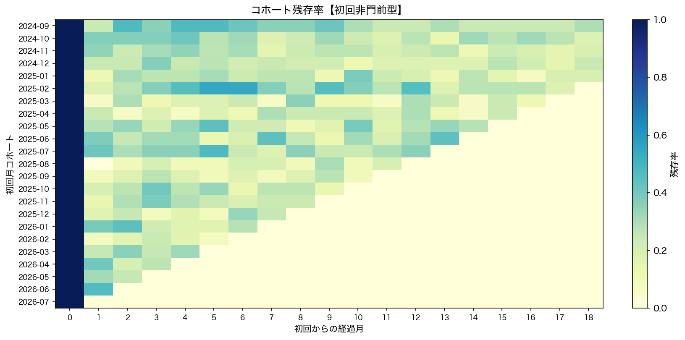
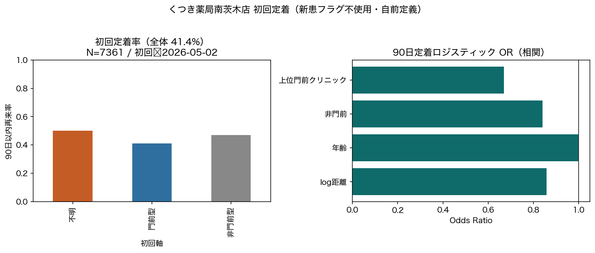
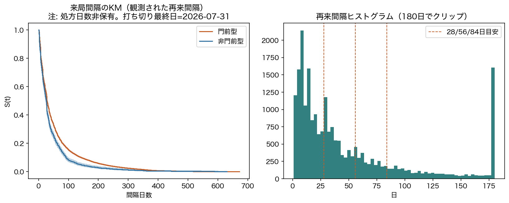
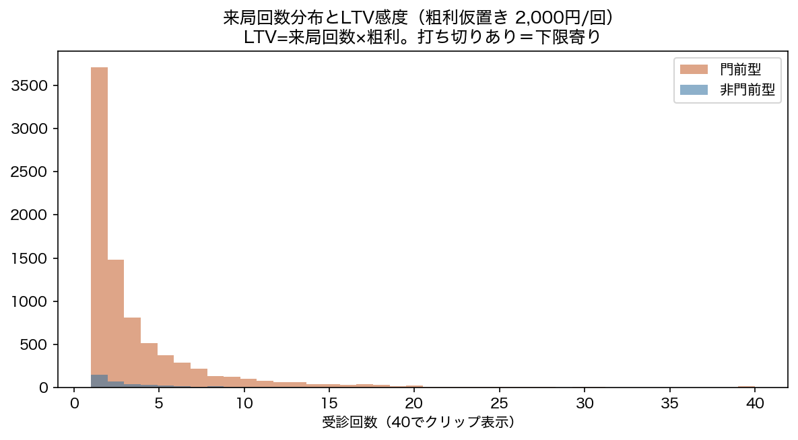
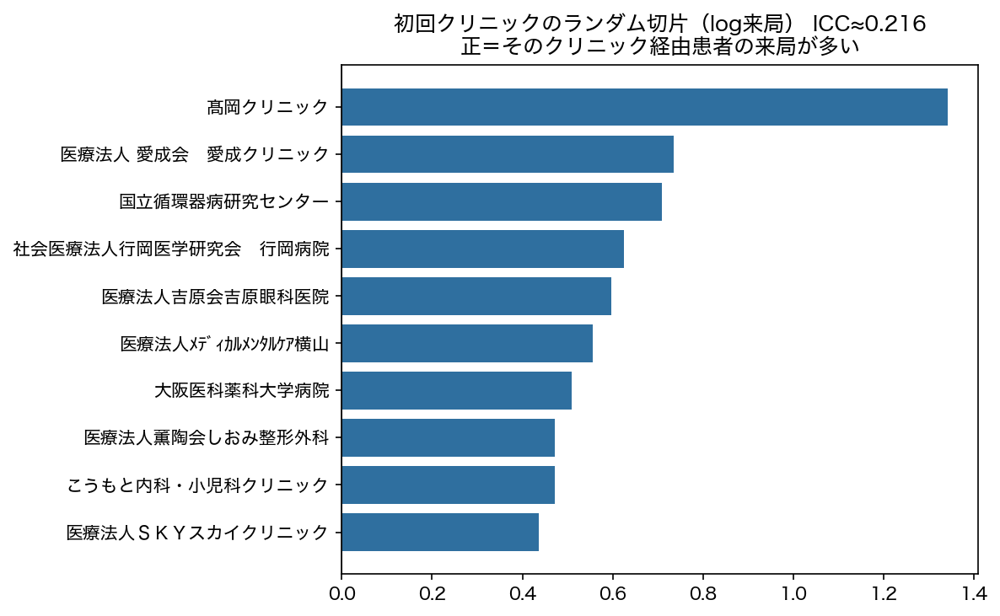
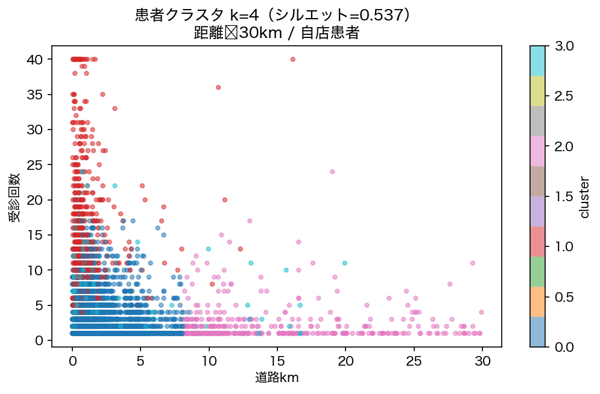

# Phase 4: 継続・定着・LTV・セグメンテーション

## わかったこと3点

1. **初回90日定着は層で差がある。** 全体定着率 41.4%（N=7,361、直近初回948人は窓未満了で除外）。
2. **再来間隔の中央値は約28日。** 28日以内再来 50.4% / 56日以内 71.2%（処方日数は非保有のため混合分布の記述）。
3. **クリニック階層のICC≈0.216。** 初回クリニックによりその後の来局量に差（ターゲティング候補）。

## わからなかったこと3点

1. **世帯・家族波及は不可。** 患者住所_詳細が全空欄（座標利用の意図的設計）。世帯クラスタ・家族波及は現データでは実行不可。
2. 処方日数がないため、間隔ピークが疾患周期性か処方日数由来か分離できない。
3. LTVは観測打ち切りありの下限寄り。粗利は仮置き。

## 次に必要なデータ

- 住所詳細（世帯分析）、処方日数、粗利単価の確定、性別

---

## 1. コホート残存





- 平均残存の目安: 3か月後 13.6% / 6か月 10.7% / 12か月 7.3%
- 門前初回の3か月残存 13.2% / 非門前初回 24.0%

## 2. 初回定着（90日）



- サンプル: 初回受診日 ≤ 2026-05-02
- McFadden擬似R²=0.009 / AIC=9914.4
- 層別: {'不明': 0.5, '門前型': 0.41170592433975733, '非門前型': 0.46875}

> 新患フラグは使用していない（識別力なし）。

## 3. 来局間隔・生存



- 観測間隔 N=22,625 / Cox c-index=0.528

## 4. 世帯波及

**実行不可（住所詳細 8,885/8,885 が空欄）。**

## 5. LTV



- 粗利仮置き: 2,000 円/回（`config/economics.yaml`）
- 平均来局 3.59 回

```
 粗利円     平均LTV_全体     平均LTV_門前    平均LTV_非門前
1000  3593.021947  3531.231195  5340.476190
2000  7186.043894  7062.462390 10680.952381
3000 10779.065841 10593.693585 16021.428571
5000 17965.109736 17656.155975 26702.380952
```

## 6. マルチレベル



- ICC≈0.216 / グループ数=192

## 7. クラスタ



- 採用 k=4（シルエット=0.537）

```
        人数    道路km    年齢         来局    クリニック数      非門前率
クラスタ                                                   
0     6713   1.265  34.0   2.552510  1.124534  0.000000
1      752   0.600  29.5  14.312500  3.105053  0.019947
2      394  11.994  34.0   2.378173  1.121827  0.012690
3      370   0.889  37.5   4.286486  1.762162  1.000000
```

## 限界

- 年齢は基準日2026-07-31固定
- 自店来局のみ
- 因果表現はしない
